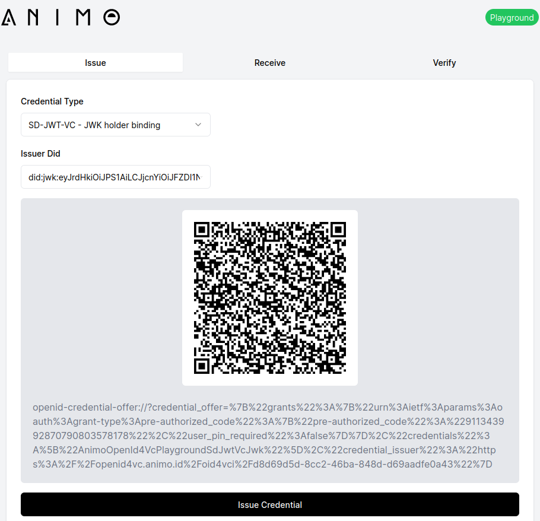

<p align="center">
  <br />


</p>

<h1 align="center"><b>Funke OpenID4VC Playground</b></h1>
<div align="center">
    <a
    href="https://raw.githubusercontent.com/animo/openid4vc-playground/main/LICENSE"
    ></a>
</div>

> [!TIP]
> Check out the demo at https://funke.animo.id

## ✨ Hi there!

Welcome to the repository of Animo's OpenID4VC Playground. This interactive playground demonstrates the use of OpenID4VC with different credential formats (such as SD-JWT VCs). This demo is built using [Credo](https://github.com/openwallet-foundation/credo-ts). Credo is a framework written in TypeScript for building decentralized identity services.

## 🛠️ Usage

### Prerequisites

- [NodeJS](https://nodejs.org/en/) v18.X.X - Other versions may work, not tested
- [pnpm](https://pnpm.io/installation)
- [Git](https://git-scm.com/downloads) - You probably already have this

### 🖥 App

Copy the `.env.example` file to a `.env.local` file and set the environment variables. **This is not needed for development**.

```bash
cd app
cp .env.example .env
```

| Variable              | Description                                                                                                       |
| --------------------- | ----------------------------------------------------------------------------------------------------------------- |
| `NEXT_PUBLIC_API_URL` | Used in the frontend application to connect with the backend. Default to `http://localhost:3001` for development. |

### 🎛️ Agent

Copy the `.env.example` file to a `.env.local` file and set the environment variables. **This is not needed for development**.

```bash
cd agent
cp .env.example .env
```

| Variable           | Description                                                                                   |
| ------------------ | --------------------------------------------------------------------------------------------- |
| `AGENT_HOST`       | Used in the backend application for the agent. The url at which the server will be available. |
| `AGENT_WALLET_KEY` | Used in the backend application for the agent. Should be secure and kept private.             |

> [!IMPORTANT]
> You can use `ngrok` (`npx ngrok http 3001`) and use that url as the `AGENT_HOST` variable. Make sure to also set the `NEXT_PUBLIC_API_URL` variable in the app to the ngrok.
>
> We may add issuance using did:key in development if the host url does not start with `https`.

### Install Dependencies

```bash
pnpm install
```

### Development

Open three terminal windows, and then run the following:

```bash
npx ngrok http 3001
```

Copy the https url from the ngrok command and set that as the `AGENT_HOST` and `AGENT_DNS`

```bash
cd agent
AGENT_DNS=30f9-58-136-114-148.ngrok-free.app AGENT_HOST=https://30f9-58-136-114-148.ngrok-free.app pnpm dev
```

```bash
cd app
pnpm dev
```

## 🖇️ How To Contribute

You're welcome to contribute to this playground. Please make sure to open an issue first!

This playground is open source and you're more than welcome to customize and use it to create your own OpenID4VC Playground. If you do, an attribution to [Animo](https://animo.id) would be very much appreciated!
